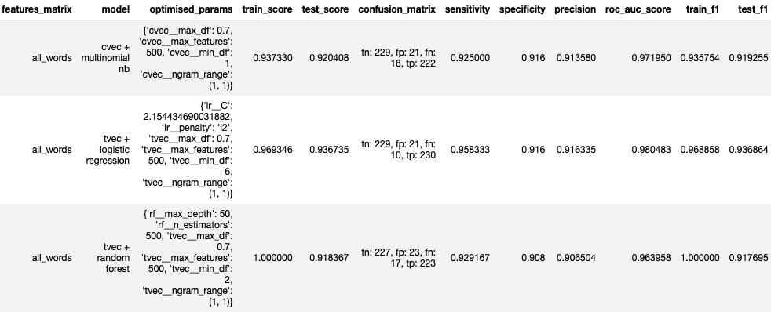
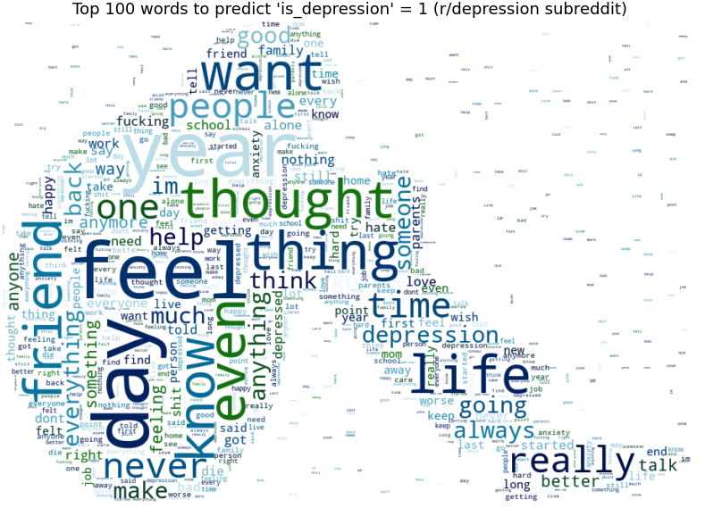
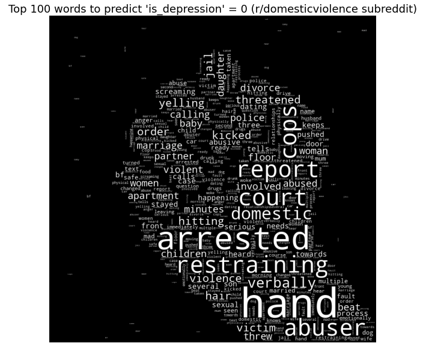

## Project 3: Identifying Depression in Subreddit Posts


### Problem Statement

As a result of the COVID-19 pandemic, there has been an increase in domestic violence at incidents home as people are confined to their homes for long periods of time<sup>[[1]](https://www.nytimes.com/2020/04/06/world/coronavirus-domestic-violence.html)</sup>. Research has also found that people suffering from domestic violence are also found to be at higher risk of depression<sup>[[2]](https://www.theguardian.com/society/2019/jun/07/domestic-abuse-victims-more-likely-to-suffer-mental-illness-study)</sup>. Also, when r/domesticviolence posts, many posts about domestic violence experiences seemingly contain words that indicate depressive feelings. Due to the large number of posts on the r/domesticviolence subreddit daily, authors who suffer from depression may go unnoticed and may not be identified to be offered help. This model seeks to solve this problem by taking a proactive approach to identifying such posts in order to direct help to these authors. 

Using two subreddits, r/domesticviolence and r/depression, in which people post about their domestic violence and depression experience respectively, a model will be developed to learn the words that typically exist in posts from r/domesticviolence or r/depression, and predict which subreddit a post should belong in --- ```is_depression``` = 1 for a r/depression post and ```is_depression``` = 0 for a r/domesticviolence post.

The model can then be run on posts extracted from r/domesticviolence. If a post contains enough words indicating depression to be predicted as a r/depression post (```is_depression``` = 1), the authors of these posts can be identified by their user ID. These people, who are at risk of depression, could be identified to mental health support groups who will reach out to offer support and assistance.

### Executive Summary

From the r/domesticviolence and r/depression subreddits, 998 and 960 posts were collected via json extraction from Reddit's API respectively. These subreddits were chosen as they had dominantly text-based data which was advantageous for NLP and had a high number of posts. 

Following which, data cleaning was done to replace null values. Preprocessing was then done on the raw data, which consisted of tokenizing, removing stop words and lemmatizing. From the cleaned and preprocessed data, three key features were retained: words in title (```title```) and words in post (```self_text```). An ```is_depression``` column was added to show if the post was from r/depression (```is_depression``` = 1) or r/domesticviolence (```is_depression``` = 0). Another column (```all_words```) which combined words from ```title``` and ```selftext``` was added.

EDA conducted to take a preliminarily look at the top words in each subreddit to verify that there are indeed some similarities in words between both subreddits. The EDA also identified that posts in r/domesticviolence tend to be longer than posts in r/depression. In addition, the data also showed that authors who posted in r/domesticviolence did not post in r/depression, and vice-versa. This gives additional credence to the hypothesis that authors of r/domesticviolence posts showing indications of depression through their posts may go unnoticed. 

Based on the cleaned data, the feature matrix (X) was created with either ```title``` (words from title), ```post``` (words from post) or ```all_words``` (word from both title and post). The target vector is ```is_depression```). Modeling was done on 3 classification models: Multinomial Naive Bayes, Logistic Regression and Random Forest, all with either Count Vectorization or TF-IDF Vectorization. The results of the models were assessed based on their performance (accuracy score, ROC AUC score, variance between train and test scores, etc). All of the models outperformed the baseline accuracy score of 0.50. The results are below:



The final production model was determined to be the Multinomial Naive Bayes model + Count Vectorization on the ```all_words``` feature matrix due to its high accuracy, ROC AUC and sensitivity (low Type-II error) scores as well as low variance, which means the model will generalise well on unseen data. In addition, the model was tested on two posts from r/domesticviolence - one containing many words indicating depression and one without words indicating depression. It predicted ```is_depression``` = 1 for the 'depressive' post and ```is_depression``` = 0 for the 'non-depressive' post. This is evidence that the model, in addition to being able to differentiate between r/domesticviolence and r/depression posts, is able to identify posts from r/domesticviolence that contain many words indicating depression, so that mental health groups may reach out to the author. 

This model is just the tip of the iceberg in the relatively new usage of Natural Language Processing to predict mental health issues<sup>[[3]](https://www.hindawi.com/journals/cmmm/2016/8708434/)</sup>. As the use of social media and discussion sites such as Reddit increases, the need for such tools will become increasingly important, particularly in light of increased domestic violence incidents due to COVID-19. Going forward, there are several things that can be done to improve on this model. For instance, gathering more data (words) to improve model performance, introduce an ```is_suicide``` classification as the EDA revealed words indicating suicidal thoughts in r/domesticviolence posts, and adapting the model to predicting ```is_depression``` in other subreddits where people post about their traumatic experiences (similar to r/domesticviolence).  


### Contents
- [Webscraping and Data Collection](./1_Webscraping_and_Data_Collection.ipynb)
- [Preprocessing and EDA](./2_Preprocessing_and_EDA.ipynb)
- [Modeling - Multinomial Naive Bayes](./3_Modeling_Multinomial_Naive_Bayes.ipynb)
- [Modeling - Logistic Regression](./4_Modeling_Logistic_Regression.ipynb)
- [Modeling - Random Forest](./5_Modeling_Random_Forest.ipynb)
- [Production Model and Insights](./6_Production_Model_and_Insights.ipynb)


### Data dictionary for modeling notebooks 
|Feature|Type|Description|
|---|---|---|
|is_depression|int|A binary column where 1 = post belongs in r/depression subreddit and 0 = post belongs to r/domesticviolence subreddit (This is the target vector (y)|
|post|object|Words in a subreddit post (preprocessed)|
|title|object|Words in a subreddit title (preprocessed)| 
|all_words|object|Combined words from subreddit title and post (preprocessed)|
|post_word_count|int|Number of words in subreddit post| 


### Word cloud of top words for ```is_depression``` = 1 predictions 


### Word cloud of top words for ```is_depression``` = 0 predictions 



### Recommendations

Going forward, there are several things that can be done to improve on this model
- Gather more data
    - Only 1000 posts were scraped from r/domesticviolence and r/depression. More posts can be extracted to make the model more robust by introducing more words
- Run data on more classification models 
    - While a good score was obtained from the multinomial NB model, the data can be run on other models such as SVM which, due to the time constraints on this project I was unable to do.
- Introduce a ```is_suicide``` classification 
    - In the top words predicting ```is_depression``` = 1, words like suicide and suicidal have surfaced. Thus, the model can be expanded to include posts from the r/SuicideWatch subreddit to identify if authors of posts in r/domesticviolence have suicidal thoughts 
- The ```is_depression``` classification can be adapted to other subreddits where people post about their traumatic experiences to help more groups of people (i.e., similar to r/domesticviolence)
- Modeling can be done on the ```post_word_count``` column to boost the accuracy of ```is_depression``` predictions
    - EDA showed that the length of r/domesticviolence posts were longer than r/depression posts, an indicator that length of post could be a factor in ```is_depression``` predicictions 
